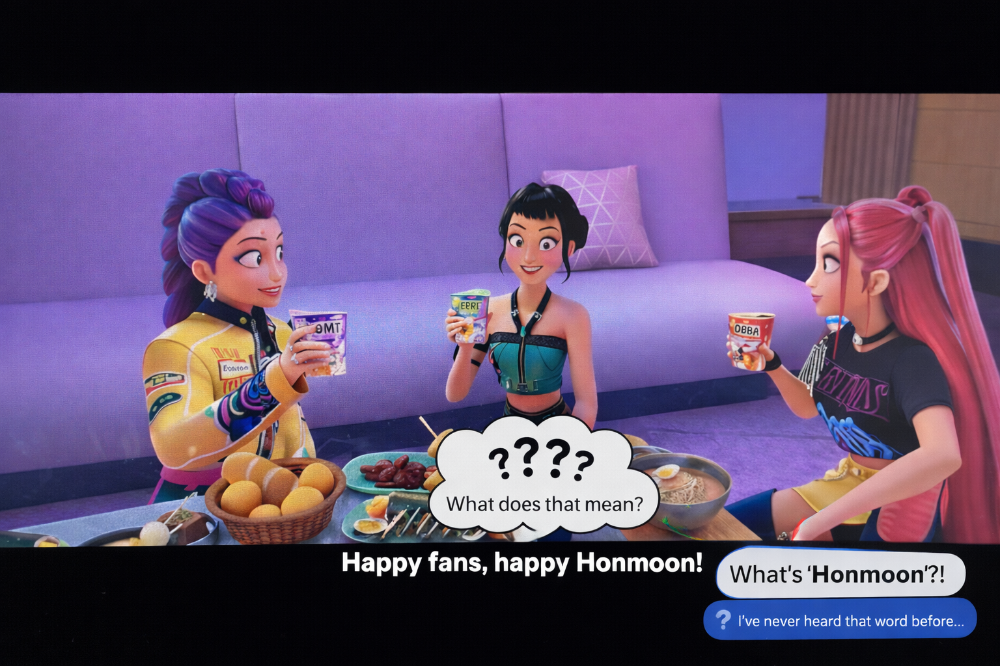
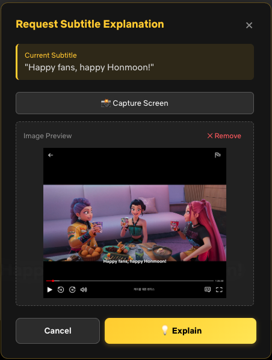
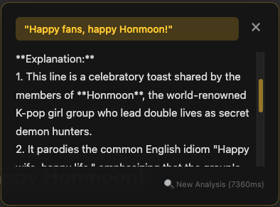
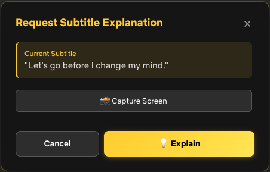

<div align="center">

# 🎬 DocentAI - Chrome Extension

**Your Personal Video Docent**  
*Like a museum docent guiding you through art, \
DocentAI is your AI guide through Netflix narratives — understanding context and explaining clearly*


[](https://github.com/tnfhrnsss/docentai-core)
[](https://github.com/tnfhrnsss/docentai#installation)
[](https://github.com/tnfhrnsss/docentai#-quick-start)

🌐 **[Visit Landing Page →](https://tnfhrnsss.github.io/docentai)**

> **🚧 Installation Status:** Currently available via manual installation for testing and hackathon review. Chrome Web Store release planned after hackathon review period.

[🚀 Quick Start](#-quick-start) • [🔧 Installation](#-installation) • [🏗️ Architecture](#️-architecture) • [🏆 Hackathon](#-built-for-gemini-3-hackathon)

</div>

---

## 🎯 What is DocentAI?

DocentAI is a AI-Powered subtitle explanation tool that explains Netflix subtitles with contextual understanding.

### vs Language Learning Tools

DocentAI is NOT a language learning tool. It's a **narrative comprehension tool**.

### DocentAI is for:
- Native speakers confused by complex plots
- Viewers who want deeper understanding
- Educational analysis of narratives
- Accessibility for comprehension difficulties

### Repository
1. **This Repository (Frontend)**: Chrome Extension for Netflix integration
2. **[Backend Repository](https://github.com/tnfhrnsss/docentai-core)**: AI processing server powered by Gemini 3


<table>
<tr>
<td width="50%">

### This Repository Contains:
- Chrome Extension (Manifest V3)
- Netflix UI integration
- User interaction handling
- Subtitle context tracking
- API client

</td>
<td width="50%">

### Backend Handles:
- 🤖 Gemini 3 Flash integration
- Search Grounding & databases
- AI reasoning & analysis
- GCP Cloud Run deployment

👉 **[See Backend Repo →](https://github.com/tnfhrnsss/docentai-core)**

</td>
</tr>
</table>

---

## 💡 The Problem

Have you ever watched a Korean drama and thought:

> *"Wait, who's that person again?"*  
> *"When did they meet before?"*  
> *"What's happening? I'm so lost!"*

**Complex narratives** with references to past episodes, intricate character relationships, and cultural context often leave viewers confused.

The usual solution? **Pause → Google → Spoilers → Frustration** 😤



---

## ✨ Our Solution

Just **press `Ctrl+E`** when you see confusing dialogue:



**What You Get:**
- **Character Context** - Who's who and how they're connected
- **Visual Analysis** - Optional screen capture for better context
- **External Knowledge**



---

## 🎬 Video Demo

[](https://youtu.be/BUbfO1P8-Bs)

**👉 [Watch on YouTube](https://youtu.be/BUbfO1P8-Bs)**

See DocentAI in action — how it works on Netflix, keyboard shortcuts, and AI explanations with multimodal analysis.

---

## 🚀 Quick Start

### Prerequisites

**1. Backend Server** - Already live on GCP!
- ✅ API Status: https://docentai-api-1064006289042.asia-northeast3.run.app/health
- No backend setup needed for testing

**2. Chrome Browser** (latest version recommended)

### Installation (Manual - Dev Mode)

```bash
# 1. Clone this repository
git clone https://github.com/tnfhrnsss/docentai
cd docentai

# 2. Build extension (Development mode includes all features)
python build.py --mode dev

# 3. Load in Chrome
#    - Navigate to chrome://extensions/
#    - Enable "Developer mode" (top right toggle)
#    - Click "Load unpacked"
#    - Select build/extension/ folder

# 4. Visit Netflix and press Ctrl+E!
```

### Chrome Web Store Release

🏪 **Coming Soon** - Public release planned after hackathon review period. One-click installation will be available!

### Configuration

If using local backend, update the API endpoint:

```javascript
// Edit: extension/lib/config.js

const CONFIG = {
  // Development (local backend)
  API_BASE_URL: 'http://localhost:7777',
  
  // Production (GCP) - Default
  // API_BASE_URL: 'https://docentai-api-1064006289042.asia-northeast3.run.app'
};
```

<details>
<summary>📦 Alternative: Install from ZIP</summary>

1. Download `build/docentai-ui-dev-v1.0.0.zip` from releases
2. Extract the ZIP file
3. Load unpacked extension (same as step 3 above)

</details>

---

## 🎯 How to Use

### Two Ways to Explain Subtitles

#### 1. Keyboard Shortcut (Fastest)
```
Press: Ctrl+E (Windows/Linux)
       ⌘+E (Mac)
```

#### 2. 💡 Floating Button
```
Click the golden 💡 button in the bottom-right corner
```

### Action Panel Features




When the action panel appears:

- **Request Explanation** - Get AI analysis with current context
- **Capture Screen** - Add visual context (Dev mode only)
- **Cancel** - Close panel

---

## System Architecture

### Full DocentAI System

```
┌─────────────────────────────────────────────────────────┐
│                DocentAI - Complete System                │
└─────────────────────────────────────────────────────────┘

┌─────────────────────────┐
│  THIS REPOSITORY        │
│  Chrome Extension       │
│  (Frontend/UI)          │
├─────────────────────────┤
│ • Netflix Integration   │
│ • Subtitle Detection    │
│ • Context Tracking      │
│ • User Interface        │
│ • API Client            │
└──────────┬──────────────┘
           │
           │ HTTPS/REST API
           ↓
┌─────────────────────────┐
│  BACKEND REPOSITORY     │
│  AI Processing Server   │
│  (GCP Cloud Run)        │
├─────────────────────────┤
│ • Gemini 3 Flash API    │ ⭐ AI Magic!
│ • Search Grounding      │
│ • Function Calling      │
│ • SQLite (Production)   │
└─────────────────────────┘
           │
           ↓
    [Gemini API] (Google AI)
```

**👉 [See Backend Architecture Details →](https://github.com/tnfhrnsss/docentai-core#architecture)**

### Backend AI Capabilities

The backend (docentai-core) provides powerful AI features powered by Google Gemini 3:

**🔍 Search Grounding**
- Built-in web search powered by Gemini API
- No separate Search API needed
- Automatic source attribution
- Real-time knowledge gathering about shows, characters, and plots

**⚡ 2-Step Architecture**
- **Step 1:** Video registration → Search Grounding (once per video)
- **Step 2:** Fast explanations using cached references
- Cost-optimized design for production use

👉 **[See Backend Details →](https://github.com/tnfhrnsss/docentai-core#key-features)**

---

### Frontend Architecture (This Repository)

```
Chrome Extension (Manifest V3)
│
├── Content Script (content.js)
│   ├─ NetflixDetector
│   │  └─ Extract video metadata, subtitles, timestamps
│   │
│   ├─ SubtitleCacheManager
│   │  └─ Track last 10 subtitles for context
│   │
│   └─ UIComponents
│      └─ Create action panel, explanation panel
│
├── Background Service Worker (service-worker.js)
│   ├─ Screen capture (dev mode)
│   ├─ Image upload handling
│   └─ Cross-origin requests
│
└── Libraries (lib/)
    ├─ APIClient - Backend communication
    ├─ Config - Environment settings
    └─ i18n - Multi-language support
```

---

## API Integration

This extension communicates with the backend via REST API.

### API Endpoints Used

| Endpoint | Purpose | Details |
|----------|---------|---------|
| `POST /api/video/register` | Register video for analysis | [Backend Docs](https://github.com/tnfhrnsss/docentai-core/blob/main/docs/API.md#register-video) |
| `POST /api/image/upload` | Upload screenshot | [Backend Docs](https://github.com/tnfhrnsss/docentai-core/blob/main/docs/API.md#upload-image) |
| `POST /api/explain` | Get AI explanation | [Backend Docs](https://github.com/tnfhrnsss/docentai-core/blob/main/docs/API.md#explain-subtitle) |
| `GET /api/video/:id/status` | Check processing status | [Backend Docs](https://github.com/tnfhrnsss/docentai-core/blob/main/docs/API.md#video-status) |

**Full API documentation:** [Backend API Docs](https://github.com/tnfhrnsss/docentai-core/blob/main/docs/API.md)

---

## 🛠️ Tech Stack (Frontend)

```
Extension Framework:
├─ Manifest V3 (Latest Chrome Extension API)
├─ Vanilla JavaScript (No frameworks - lightweight)
└─ Chrome APIs (Storage, Runtime, Tabs)

User Interface:
├─ CSS3 (Animations, transitions)
├─ Custom components (No UI library)
└─ Responsive design

Communication:
├─ Fetch API (Backend requests)
└─ Chrome Message Passing

Build System:
├─ Python build script (Multi-mode builds)
└─ Environment-based configuration

Internationalization:
├─ Chrome i18n API
└─ Supported: Korean, English
```

**Backend Tech Stack:** [See Backend README](https://github.com/tnfhrnsss/docentai-core#tech-stack)

---

## 📦 Build System

DocentAI has **two build modes** to comply with Chrome Web Store policies while maintaining full functionality for demonstrations.

### Development Build ⭐ (Recommended for Testing & Review)

```bash
python build.py --mode dev
```

**Includes:**
- Screen capture feature (`features/capture/`)

**Output:** `build/docentai-ui-dev-v1.0.0.zip`

### Production Build (Future Chrome Web Store Release)

```bash
python build.py --mode prod
```

**Excludes:**
- ❌ Screen capture (DRM policy compliance)
- ❌ Debug logging

**Output:** `build/docentai-ui-prod-v1.0.0.zip`

> **Note:** Chrome Web Store submission is planned. The production build will be used for public release.

### Why Two Build Modes?

Chrome Web Store doesn't allow extensions to capture screens on DRM-protected content (Netflix). Our modular architecture cleanly separates this feature:

```
extension/
├── features/
│   └── capture/              ← 📸 This folder
│       ├── capture-feature.js        (Excluded in prod)
│       ├── service-worker-capture.js (Excluded in prod)
│       └── imageIO-utils.js          (Excluded in prod)
└── ...
```

**Build Process:**
1. `manifest.template.json` → `manifest.json` (flag substitution)
2. **Dev mode**: Includes all files
3. **Prod mode**: Excludes `features/capture/` folder

---

## 🔧 Development

### Project Structure

```
docentai-ui/
├── extension/
│   ├── content/
│   │   ├── content.js              # Main content script
│   │   ├── netflix-detector.js     # Video detection
│   │   ├── subtitle-cache.js       # Context tracking
│   │   └── ui-components.js        # UI creation
│   │
│   ├── background/
│   │   └── service-worker.js       # Background tasks
│   │
│   ├── lib/
│   │   ├── api-client.js           # Backend API
│   │   ├── config.js               # Configuration
│   │   └── i18n-helper.js          # Localization
│   │
│   ├── features/
│   │   └── capture/                # 📸 Screen capture (dev)
│   │       ├── capture-feature.js
│   │       ├── service-worker-capture.js
│   │       └── imageIO-utils.js
│   │
│   ├── _locales/                   # i18n
│   │   ├── ko/
│   │   │   └── messages.json
│   │   └── en/
│   │       └── messages.json
│   │
│   ├── assets/                     # Icons, images
│   ├── manifest.template.json      # Template
│   └── styles.css                  # Styles
│
├── build/                          # Build output
│   ├── extension/                  # Unpacked
│   └── *.zip                       # Packaged
│
├── build.py                        # Build script
├── .env.example                    # Environment template
└── README.md                       # This file
```

### Local Development

```bash
# 1. Clone and install
git clone https://github.com/tnfhrnsss/docentai
cd docentai-ui

# 2. Configure environment
cp .env.example .env
# Edit .env if needed

# 3. Build
python build.py --mode dev

# 4. Load in Chrome
# chrome://extensions/ → Load unpacked → build/extension/

# 5. Make changes
# Edit files in extension/

# 6. Rebuild
python build.py --mode dev

# 7. Reload extension in Chrome
# chrome://extensions/ → Click reload icon
```

### Testing

```bash
# Test on Netflix
1. Visit https://www.netflix.com
2. Play any video
3. Press Ctrl+E
4. Check console for logs (F12)

# Test API integration
# Make sure backend is running first
curl http://localhost:7777/health
```

---

## 🌍 Supported Languages

### Languages

- 🇰🇷 **Korean** - Full support
- 🇺🇸 **English** - Full support

The extension automatically detects your browser language and adapts the UI accordingly.

---

## Known Issues

### Netflix DRM Protection ⚠️

**Issue:** Chrome's `captureVisibleTab` API is blocked by Netflix's DRM (Digital Rights Management)

**Impact:** Screen capture feature may not work in production environments

**Workarounds:**
1. **Development Build**: Uses alternative capture methods (may still be blocked)
2. **File Upload**: Use system screenshot tool (Win+Shift+S, Cmd+Shift+4) and upload via 📁 button
3. **Text-only**: Skip image capture, use text context only

**Note:** This is why we have separate dev/prod builds. The dev build attempts capture for demonstration purposes.

---

## 📄 License

MIT License - See [LICENSE](LICENSE) for details.

---

## 🔗 Related Repositories

| Repository | Description | Status |
|------------|-------------|--------|
| **[docentai](https://github.com/tnfhrnsss/docentai)** | Chrome Extension (You are here) | ✅ Active |
| **[docentai-core](https://github.com/tnfhrnsss/docentai-core)** | AI Backend Server | ✅ Live on GCP |


---

<div align="center">

**This is the frontend component of DocentAI.**

**For AI backend and Gemini 3 integration details:**
**👉 [Visit docentai-core →](https://github.com/tnfhrnsss/docentai-core)**

---

[⬆ Back to Top](#-docentai---chrome-extension)

</div>
